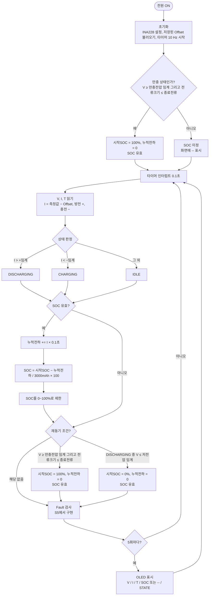

# bms_fw_nucleo

ELECOURSE 2026 Fall FPGA-BMS 프로젝트 펌웨어팀 **디스플레이+@** 작업 저장소.
Samsung INR18650-30Q 셀의 SOC를 Coulomb Counting으로 계산하고 OLED에 표시하는 STM32 펌웨어.

## 하드웨어

| 구분 | 소자 |
|---|---|
| MCU | NUCLEO-F411RE (STM32F411RET6) |
| 전압/전류 | INA228, I2C1 (PB6 SCL / PB7 SDA), 주소 0x40 |
| 션트 | Vishay WSK2512R0100FEA, 10 mΩ |
| 온도 | Vishay NTCLE317E4103SBA, 10 kΩ, B25/85 = 3984 K |
| 디스플레이 | 0.96" I2C OLED 128x64 (SSD1306 계열), 주소 0x3C, 디바이스마트 DIS060009 |
| PC 출력 | USART2 (ST-LINK 가상 COM), 115200 8-N-1 |

## 구조

```
TIM2 (10 Hz 인터럽트) ──▶ tick_100ms 깃발
                               │
main while(1) ──▶ bms_task_100ms()
                    ├─ 전류 읽기        (현재 더미 0.84 A, INA228 도착 후 교체)
                    ├─ SOC_Update()     (Core/Src/soc.c)
                    └─ 0.5초마다 출력   (현재 UART printf, OLED 도착 후 교체)
```

- 인터럽트에서는 깃발만 올리고, 계산과 출력은 main 루프에서 처리한다.
- 전류 부호: 흐름도 기준 방전 +, 충전 −. `soc.c`는 충전 + 규약이라 호출 시 부호를 뒤집는다.
- 링커에 float printf가 없어서 SOC는 정수 두 개로 나눠 출력한다.

## TIM2 설정

APB1 타이머 클럭 84 MHz 기준.

```
Prescaler = 8400 - 1   → 84 MHz / 8400 = 10 kHz
Period    = 1000 - 1   → 10 kHz / 1000 = 10 Hz (0.1초)
NVIC      : TIM2 global interrupt 활성화
```

## SOC Coulomb Counting 흐름도



## 진행 상황

- [x] TIM2 10 Hz 인터럽트
- [x] SOC 모듈(soc.c) 연동, 더미 전류로 보드 검증 (0.84 A 기준 감소율 이론값과 일치)
- [ ] 상태 판정 (DISCHARGING / CHARGING / IDLE)
- [ ] SOC 유효 여부, 재동기 (만충 100% / 저전압 0%)
- [ ] OLED 드라이버 (afiskon/stm32-ssd1306), I2C1 400 kHz로 변경
- [ ] INA228 / NTC 실측값으로 더미 교체
- [ ] Fault 검사 (S5)

회로팀 확인 대기: TP5000 충전 종료 전류, BQ29700 품번과 저전압 임계, 션트 IN+/IN− 방향.

## 빌드 및 실행

1. STM32CubeIDE에서 File → Import → Existing Projects into Workspace로 이 폴더를 연다.
2. 빌드 (Cmd+B / Ctrl+B).
3. 보드를 USB로 연결하고 프로젝트 우클릭 → Run As → STM32 C/C++ Application.
4. 시리얼 터미널(CoolTerm 등)에서 ST-LINK 가상 COM 포트, 115200으로 연결하면 0.5초마다 SOC가 출력된다.
